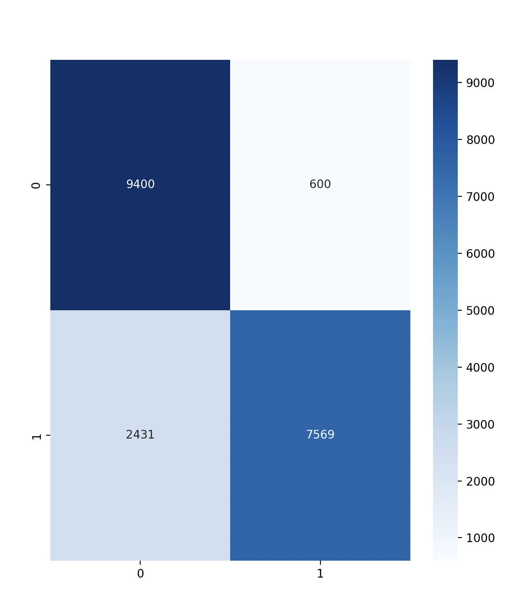
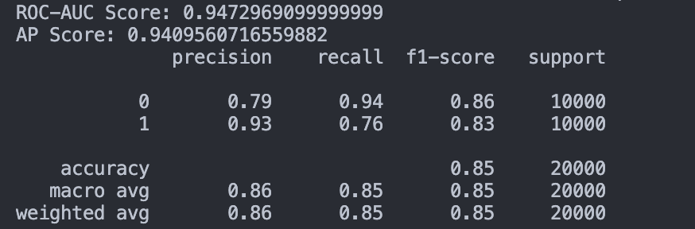

# Fake Face Detection

Basic Discriminator Built using CNN in order to detect face faces. It can be coupled with a Generator to create a Generative Adversial Network

## Dataset

Fake and Real Image dataset retreived from kaggle


## Requirements

- Python3.9+
- tensorflow
- numpy
- pandas
- opencv
- seaborn
- tkinter
- scikit-learn

## Steps to run

#### Installing Dependencies

```
pip install -r requirements.txt
```

### Training

To train the model from the beginning
```
python3 Train.py
```

### Testing

To Tests the models accuracy
```
python3 Test.py
```

### Running

To run the model on sample data
```
python3 main.py
```
Load Image -> Load Model -> Run

## Results

<br>
